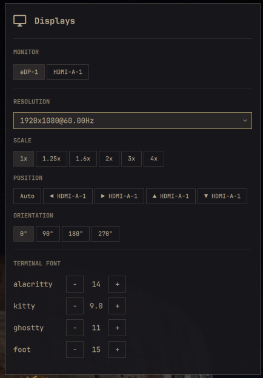

# Better Displays

A [Omarchy](https://omarchy.org/) shell plugin that puts **granular display and
terminal control** in a bar widget you open directly from the status bar.



## Features

- **Per-monitor** resolution (real modes reported by the monitor), scale,
  position (left/right/above/below another display), and orientation
  (0°/90°/180°/270°).
- **Per-terminal font size** for alacritty, kitty, ghostty, and foot, with
  live − / + steppers.
- All changes apply **live** via Hyprland and **persist** to
  `~/.config/omarchy/displays.json` and `~/.config/hypr/monitors.lua` (so they
  survive a reboot).
- A matching `omarchy display ...` CLI group and an interactive Display menu
  submenu (the scripts are installed onto `PATH` automatically).

## Requirements

- Omarchy (Hyprland-based) with the Quickshell shell.
- `bash` and `jq` (both standard on Omarchy).
- `hyprctl` (provided by Hyprland).

## Install

### Via `omarchy plugin add` (recommended)

```bash
omarchy plugin add https://github.com/nightdevil00/better.displays.git --enable
```

This clones the plugin, validates it, and enables the bar widget. When the
shell loads the plugin it **auto-installs the backend scripts** onto `PATH`
(`~/.local/bin`, falling back to `/usr/local/bin`), so the `omarchy display`
CLI group and the Display menu submenu work immediately. No manual step needed.

### Manual

```bash
git clone https://github.com/nightdevil00/better.displays.git \
  ~/.config/omarchy/plugins/better.displays
cd ~/.config/omarchy/plugins/better.displays
./install                 # symlink the backend scripts into ~/.local/bin
omarchy plugin enable better.displays
omarchy restart shell
```

## Use it

- Click the **Better Displays** icon in the bar (next to the monitor icon), or
  summon it: `omarchy-shell shell summon better.displays`.
- Pick a monitor, then adjust Resolution / Scale / Position / Orientation, and
  tune each terminal's font size.

CLI equivalents (interactive shell):

```bash
omarchy display monitor list
omarchy display monitor set DP-1 --mode 2560x1440@144 --scale 1.6 --pos 0x0 --transform 0
omarchy display terminal list
omarchy display terminal set ghostty 14
omarchy display terminal set-all 13
```

## Uninstall

```bash
~/.config/omarchy/plugins/better.displays/uninstall   # drop the PATH symlinks
omarchy plugin remove better.displays
```

(`uninstall` removes the `omarchy-display-*` symlinks; `omarchy plugin remove`
deletes the plugin folder. Order does not matter, but run both for a clean
removal.)

## How it works

The plugin folder bundles everything it needs:

```
better.displays/
├── manifest.json        # plugin metadata (bar-widget)
├── Panel.qml            # the bar widget + popup (reuses Omarchy's qs.Ui kit)
├── bin/                 # backend scripts (self-contained, travel with the plugin)
│   ├── omarchy-display-monitor
│   ├── omarchy-display-terminal
│   └── omarchy-display-pick
├── install              # symlink bin/* into ~/.local/bin (idempotent)
├── uninstall            # remove those symlinks
├── preview.png
└── README.md
```

`Panel.qml` invokes the scripts by their absolute path inside `bin/`, so the
widget works the moment the folder is present — the `install` step only exists
to expose the `omarchy display` CLI / menu.

## Security

The plugin receives monitor names, mode strings, positions, and scale values
from Hyprland (`hyprctl monitors -j`) and passes them through several layers:

**Panel.qml** — constructs `bash -c` commands to call the backend scripts. All
interpolated values (monitor name, flags, terminal names, sizes) are wrapped
with `shellEscape()` which quotes each argument with single quotes and escapes
any embedded single quotes, preventing shell metacharacter injection.

**omarchy-display-monitor** —

| Concern | Mitigation |
| --- | --- |
| Monitor name in jq filter | `jq --arg` used instead of string interpolation, so names cannot break out of the filter expression |
| Values embedded in Lua expressions (`hyprctl eval`, `monitors.lua`) | All inputs validated against strict regex patterns **before** use: output names match `[a-zA-Z0-9_-]+(:[a-zA-Z0-9_-]+)?`, modes match `WxH@R[Hz]`, positions match `XxY` or `auto`, scales are numeric, transforms are `0`–`3`. String values are also run through `lua_escape()` which escapes `\` and `"` for safe Lua double-quote embedding |
| Values used in grep/awk patterns | `persist_to_lua` uses the same `lua_escape()` output in its grep regex and awk `-v` assignments |

**omarchy-display-terminal** — validates that the terminal name is one of the
known set (`alacritty`, `kitty`, `ghostty`, `foot`) via a whitelist check and
that the font size is numeric (`^[0-9]+(\.[0-9]+)?$`).

## License

MIT — do what you like, attribute if you're feeling generous.
